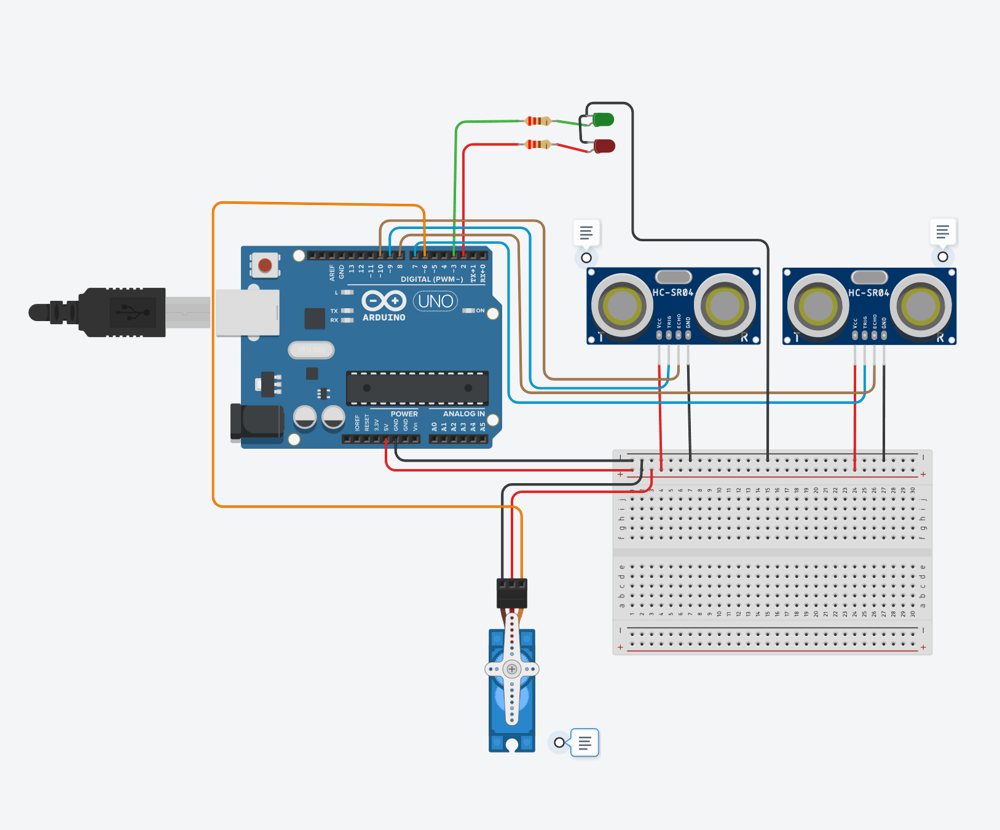

# Intelligens érintésmentes szemetes telítettségfigyeléssel

## Digitális Technika II. projekt

---

## Projekt bemutatása

Az automatizált rendszerek egyre nagyobb szerepet kapnak a mindennapi életben. Az érintésmentes eszközök higiénikusabb használatot tesznek lehetővé, ezért jelen projekt célja egy **Arduino alapú intelligens szemetes** megvalósítása.

A rendszer:

- ultrahangos szenzor segítségével érzékeli a felhasználó kezét,
- automatikusan nyitja a fedelet szervomotor segítségével,
- automatikusan visszazárja a fedelet,
- figyeli a szemetes telítettségét,
- LED-es visszajelzést ad telítettség esetén.


---

## Projekt célja

A projekt célja egy olyan rendszer létrehozása, amely:

- automatikusan nyitja a szemetes fedelét  
- automatikusan visszazárja azt  
- érzékeli a telítettséget  
- LED-es figyelmeztetést ad  
- csökkenti a fizikai érintkezést  

Tinkercad link: https://www.tinkercad.com/things/9E2ECXa2ZJD-editing-components/editel?lessonid=EFU6PEHIXGFUR1J&projectid=OGK4Q7VL20FZRV9&returnTo=https:%2F%2Fwww.tinkercad.com%2Fdashboard%2Ftutorials&sharecode=33wKBQORJ_f3qPf6_qHhf1jGNhGzGu9M3pvga_X8ZDo

---

## Felhasznált alkatrészek

| Alkatrész | Mennyiség |
|----------|------------|
| Arduino Uno | 1 |
| HC-SR04 ultrahangos szenzor | 2 |
| SG90 szervó motor | 1 |
| Piros LED | 1 |
| Zöld LED | 1 |
| 220Ω ellenállás | 2 |
| Breadboard | 1 |
| Jumper kábelek | Több |

---

## Működési elv

A rendszer működése:

1. A felhasználó keze a szenzor közelébe kerül
2. Az ultrahangos érzékelő érzékeli a közelséget
3. A szervómotor kinyitja a fedelet
4. A zöld LED jelzi a nyitott állapotot
5. Néhány másodperc után a fedél bezár
6. A második szenzor figyeli a telítettséget
7. Ha megtelt:
   - a piros LED villog
   - figyelmeztetés jelenik meg

---

## Állapotdiagram

### Normál működés

```text
START
 ↓
Kéz érzékelve?
 ↓
IGEN
 ↓
Fedél nyit
 ↓
3 mp várakozás
 ↓
Fedél zár
```

### Telítettségfigyelés

```text
Szemetes tele?
 ↓
IGEN
 ↓
Piros LED villog
 ↓
Figyelmeztetés
```

---


## Bekötések

## HC-SR04 #1 (kéz érzékelés)

| Szenzor | Arduino |
|---------|----------|
| VCC | 5V |
| GND | GND |
| TRIG | D9 |
| ECHO | D10 |

---

## HC-SR04 #2 (telítettség)

| Szenzor | Arduino |
|---------|----------|
| VCC | 5V |
| GND | GND |
| TRIG | D7 |
| ECHO | D8 |

---

## Szervó

| Szervó | Arduino |
|--------|----------|
| VCC | 5V |
| GND | GND |
| Signal | D6 |

---

## LED-ek

| LED | Arduino |
|-----|----------|
| Piros LED | D2 |
| Zöld LED | D3 |

---

## Program felépítése

A program fő funkciói:

- Távolságmérés
- Szervóvezérlés
- LED állapotkezelés
- Telítettség figyelése
- Automatikus nyitás/zárás

---

## Forráskód

```cpp
#include <Servo.h>

Servo lidServo;

// Szenzor 1 (kéz)
const int trigPin1 = 9;
const int echoPin1 = 10;

// Szenzor 2 (telítettség)
const int trigPin2 = 7;
const int echoPin2 = 8;

// LED-ek
const int redLED = 2;
const int greenLED = 3;

// Szervó
const int servoPin = 6;

bool lidOpen = false;
unsigned long lastDetected = 0;
const int openTime = 3000; // ms

void setup() {

  pinMode(trigPin1, OUTPUT);
  pinMode(echoPin1, INPUT);

  pinMode(trigPin2, OUTPUT);
  pinMode(echoPin2, INPUT);

  pinMode(redLED, OUTPUT);
  pinMode(greenLED, OUTPUT);

  Serial.begin(9600);

  lidServo.attach(servoPin);
  lidServo.write(0); // zárt

  digitalWrite(redLED, HIGH);
}


float measureDistance(int trigPin, int echoPin){

  digitalWrite(trigPin, LOW);
  delayMicroseconds(2);

  digitalWrite(trigPin, HIGH);
  delayMicroseconds(10);

  digitalWrite(trigPin, LOW);

  long duration =
    pulseIn(echoPin, HIGH);

  float distance =
    duration * 0.034 / 2;

  return distance;
}


void loop() {

  float handDistance =
    measureDistance(trigPin1,
                    echoPin1);

  float fillDistance =
    measureDistance(trigPin2,
                    echoPin2);


bool full = false;


// TELE VAN?
if(fillDistance < 15){

    full = true;

    Serial.println("SZEMETES TELE!");

    // piros LED villog
    digitalWrite(
        redLED,
        (millis()/300)%2
    );

}
else{

    full = false;
}


  // KÉZ ÉRZÉKELÉS
if(handDistance < 15 &&
   !full){

    lidServo.write(90);

    digitalWrite(
        greenLED,HIGH);

    digitalWrite(
        redLED,LOW);

    lidOpen=true;

    lastDetected=
      millis();
}


  // AUTOMATA ZÁRÁS
  if(lidOpen &&
     millis()-lastDetected >
     openTime){

      lidServo.write(0);

      digitalWrite(
        greenLED,LOW);

      digitalWrite(
        redLED,HIGH);

      lidOpen=false;
  }


  delay(100);
}
```

